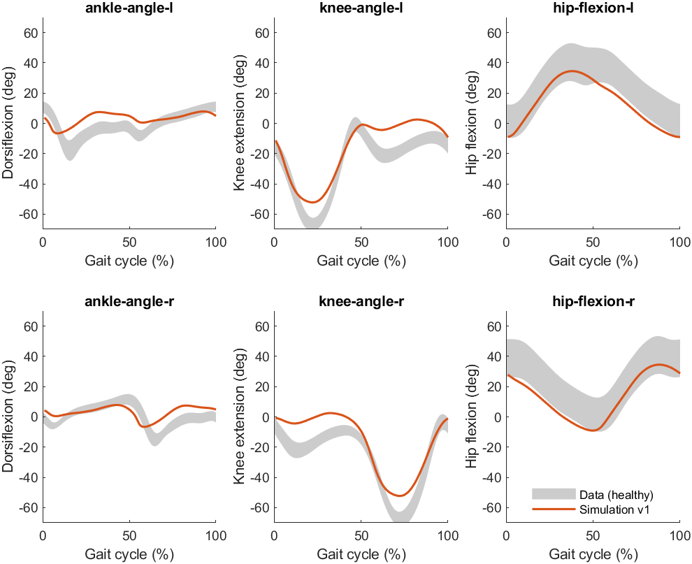
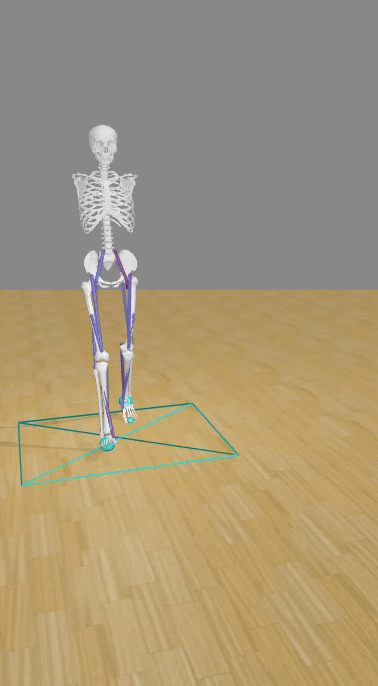

# Workshop Predictive simulations of pathological gait: from clinical data to digital twins - ESMAC 2026

Welcome to the ESMAC 2026 Workshop on Predictive simulations of pathological gait: from clinical data to digital twins!

This workshop is organized by Tom Buurke (UMCG), Friedl De Groote (KU Leuven), Tim van der Zee (KU Leuven), Ines Vandekerckhove (KU Leuven), Ellis Van Can (KU Leuven), Míriam Febrer (Universitat Politècnica de Catalunya), Lars D’Hondt (KU Leuven) and Stefanie de Jager (KU Leuven).

You can find the workshop program [here](https://github.com/KULeuvenNeuromechanics/PredSim-workshop-ESMAC-2026/blob/main/ESMAC%20PredSim%20Workshop%20Program.pdf) and the slide hand-outs [here](https://github.com/KULeuvenNeuromechanics/PredSim-workshop-ESMAC-2026/blob/main/SMALLL%20PredSim%20Workshop%20Handouts.pdf).

This repo contains the resources used during the workshop. Below is a list of the 3 hands-on tutorials:
- S1 DMD
- S2 CP
- S3 Orthosis

Tutorial specific information can be found in the respective folders.

**Dependencies**: This workshop requires [PredSim](https://github.com/KULeuvenNeuromechanics/PredSim) and [its dependencies](https://github.com/KULeuvenNeuromechanics/PredSim?tab=readme-ov-file#running-predsim-on-a-local-machine).

⚠️ Note: plug in your computer for better speed! 

## Running a reference 2D simulation with PredSim

Before going to the hands-on tutorials, the user should run a reference 2D simulation with [PredSim](https://github.com/KULeuvenNeuromechanics/PredSim). 

1. Open Matlab
2. Navigate to your `PredSim` folder in Matlab
3. Open the script `main.m` in Matlab by clicking on it
4. During this workshop the user will run predictive simulations with the 2D model instead of the default 3D model. Therefore, adjust the following lines in `main.m`:
   - Line 20:
      ```matlab
         [S] = initializeSettings('gait1018_esmac');
      ```
   - Line 25:
      ```matlab
         `S.subject.name = 'gait1018_esmac';
      ```
   - Line 51-52:
     ```matlab
     result_paths{1} = fullfile(pathRepo,'Tests','ReferenceResults',...
        'gait1018_esmac','gait1018_esmac_reference.mat');
     ```
5. Click on the green 'Run' button

Congratulations your first simulation with the 2D model is running! Running this type of simulation typically takes about 1-5 minutes, depending on your specific hardware.
After the iterations complete, verify the solver’s termination message in the MATLAB command window. If MATLAB reports **“EXIT: Optimal solution found.”**, then the optimization completed successfully and an optimal solution was obtained. If the message differs (e.g., exceeded iteration limit, infeasible problem, or no convergence), then the simulation did not successfully find an optimal solution.

## PredSimResults
Once your simulation is done, the results are stored in `PredSimResults\gait1018_esmac` as `gait1018_esmac_v1`. Note that `PredSimResults` folder is created outside your PredSim folder, so you need to go one directory up from your PredSim folder to find it. Each time you run a simulation, it is saved with an incremental version number: v1, v2, v3, v4, … The most recently run simulation will always have the highest version number. If this is the first time you ran a simulation, the results are stored in files starting with `gait1018_esmac_v1`. The following files are created:
- `gait1018_esmac_v1.mat`: contains all the output variables that can be processed and visualized using MATLAB
- `gait1018_esmac_v1.mot`: contains the motion files of the simulation, which can be visualized using OpenSim
- `gait1018_esmac_v1_log.txt`: contains the logged information about the simulation

## Visualizing your simulation results

### Visualization in MATLAB
To visualize the results in MATLAB, run the script `plot_results.m`. You should see the figure shown below:



The grey shaded region shows experimental data from nine healthy participants (data source: [van der Zee et al., 2022](https://www.nature.com/articles/s41597-022-01817-1)). You may notice that there are differences between healthy data (grey) and the healthy simulation (red). These differences are in part due to using a 2D model instead of a (more accurate) 3D model. In addition, differences between simulation and data are also due to the fact that our understanding of human walking is currently incomplete. We are still actively improving our simulations to yield better agreement with experimental data (e.g. [d'Hondt et al., 2024](https://journals.plos.org/ploscompbiol/article?id=10.1371/journal.pcbi.1012219); [Afschrift et al., 2025](https://journals.plos.org/ploscompbiol/article?id=10.1371/journal.pcbi.1012713)). 

### Visualizing in OpenSim
To visualize the simulation in OpenSim:
1. Open OpenSim
2. Click on 'File > Open Model...' and navigate to the 2D model `PredSim/Subjects/gait1018_esmac/gait1018_esmac.osim`
3. Click on 'File > Load Motion...' and navigate to the mot file of your simulation `PredSimResults/gait1018_esmac/gait1018_esmac_v1.mot`
4. Click on the 'Play forward' button to see the motion. You may also adapt the playback speed.

The video should look similar to the one shown below:



**Note**: this is a relatively simple 2D model without arms. PredSim can also be used with more realistic, 3D models (see [PredSim](https://github.com/KULeuvenNeuromechanics/PredSim)).

## Getting started with one of the cases
Before starting one of the three cases, make sure that this repository is added to your Matlab path.

1. Either download or clone [the current repository](https://github.com/KULeuvenNeuromechanics/PredSim-workshop-ESMAC-2026) 
2. Open Matlab
3. Navigate to the `PredSim-workshop-ESMAC-2026` folder
4. Open the script called `set_up_paths.m`
5. Click on the green 'Run' button

Now you're ready to start with one the three cases!
- [S1 DMD](https://github.com/KULeuvenNeuromechanics/PredSim-workshop-ESMAC-2026/tree/main/S1%20DMD)
- [S2 CP](https://github.com/KULeuvenNeuromechanics/PredSim-workshop-ESMAC-2026/tree/main/S2%20CP)
- [S3 Orthosis](https://github.com/KULeuvenNeuromechanics/PredSim-workshop-ESMAC-2026/tree/main/S3%20Orthosis)

## Switching to another case
Once you have completed one case, you may want to switch to another. In that case, please remove any edits you made to the `update_settings.m` file. Before starting a new case, it should look like this:

 ```matlab
function[S] = update_settings(S)

% Full gait cycle simulations instead of Half gait cycle (default) simulations
S.misc.gaitmotion_type = 'FullGaitCycle';

end
```
