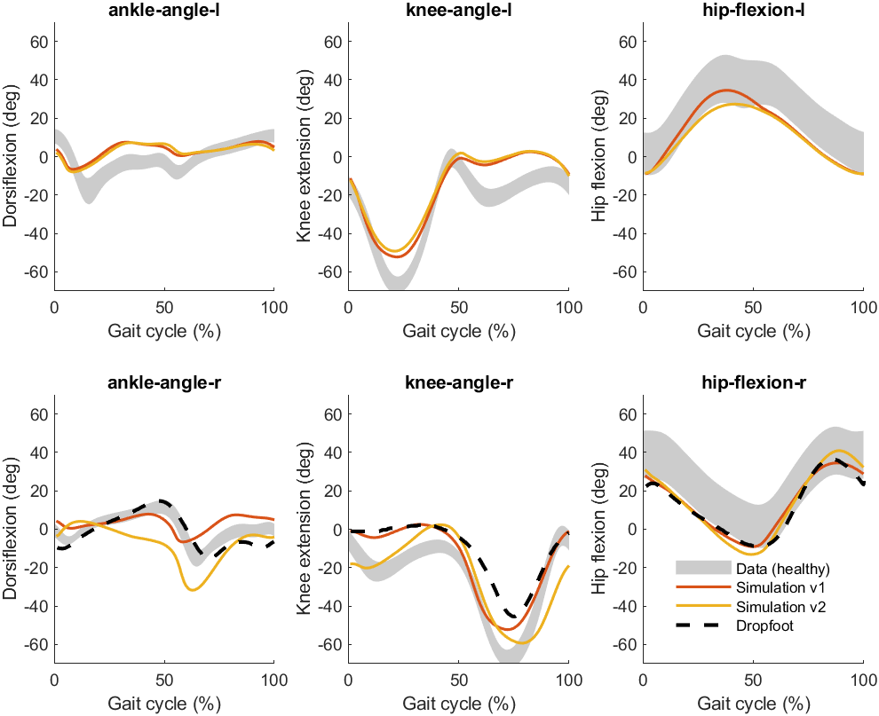
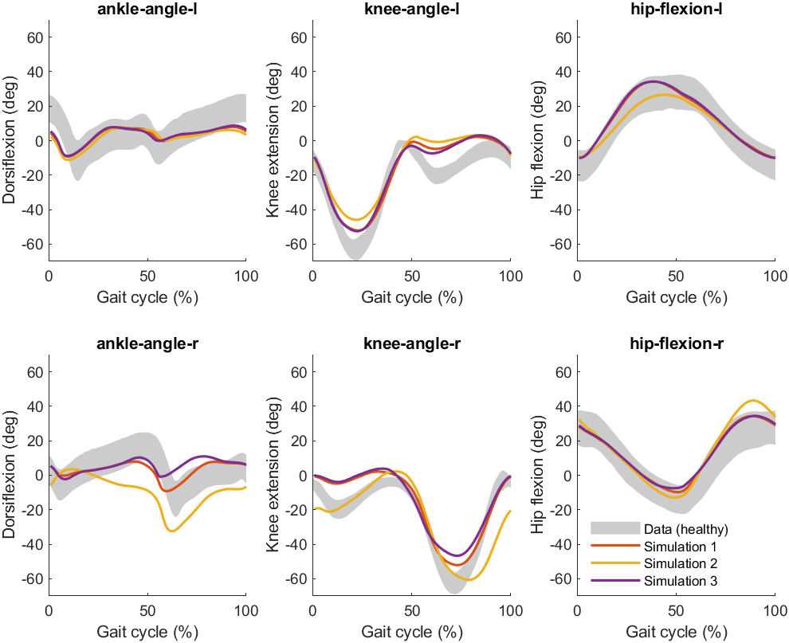

# Simulate the effects of an ankle-foot orthosis on impaired gait

An ankle-foot orthosis is a brace worn on the lower leg, ankle, and foot to provide support, stability, and control movement. Ankle-foot orthoses may improve gait in individuals with movement impairments, but it remains difficult to predict how the properties of an ankle-foot orthosis (e.g. rotational stiffness, neutral angle) influence gait. What is optimal for one individual may not be optimal for another. Predictive simulations may be used to predict the combined effects of specific individual deficits (e.g. dropfoot) and device properties (e.g. ankle-foot orthosis stiffness) on gait patterns. 

Dropfoot (or foot drop) is a gait abnormality in which the dropping of the forefoot happens out of weakness, irritation or damage to the deep fibular nerve or paralysis of the muscles in the anterior portion of the lower leg such as the tibialis anterior (e.g., [Stewart, 2008](https://pubmed.ncbi.nlm.nih.gov/18502948/)). It is usually a symptom of a greater problem, not a disease in itself. Dropfoot is characterized by inability or impaired ability to raise the toes or raise the foot from the ankle (i.e., dorsiflexion).

In this case study, you are going to investigate the effects of an ankle-foot orthosis on gait patterns in individuals with dropfoot in 2 steps:
1. Simulate dropfoot by inducing weakness to the model's tibialis anterior muscle. After inducing weakness, you will predict the resulting gait pattern and its deviations from a healthy gait pattern.
2. Adding a passive ankle dorsiflexion ankle-foot orthosis to the model. After adding the ankle-foot orhosis, you will predict the resulting gait pattern. You will compare the predicted gait both with a healthy gait pattern, and with an abnormal gait pattern due to weakness of the tibialis anterior (obtained in Step 1). 

## Step 0: run a reference simulation with the 2D model
If you have not already done so, you need to run a reference simulation of healthy walking with the 2D model. Please follow the steps explained [here](https://github.com/KULeuvenNeuromechanics/PredSim-workshop-smalll-2025?tab=readme-ov-file#running-a-reference-2d-simulation-with-predsim).

## Step 1.1: inducing weakness to the tibialis anterior
Next, you will induce weakness to the model's tibialis anterior. To do so, edit the function `PredSim-workshop-smalll-2025/code/update_settings.m` to update the settings. In this function, add the following lines of code:

```matlab
strength_level = .05; % specify the strength level (0-1)
S.subject.muscle_strength   = {{'tib_ant_r'}, strength_level};
```

This results in reducing the tibialis anterior strength of the right leg (`tib_ant_r`) to 5% of its default level. 

Next, in `Predsim/main.m`, on the (empty) line below `[S] = initializeSettings('gait1018');` (i.e. `line 21`), add the following line of code:

```matlab
S = update_settings(S);
```

This is required to make sure that `Predsim` uses the updated settings.

## Step 1.2: simulate effect of tibialis anterior muscle weakness on walking
You can now run a simulation with induced weakness of the tibialis anterior, simply by running the `Predsim/main.m` script. Once your simulation is done, the results are stored in `PredSimResults\gait1018` (as explained [here](https://github.com/KULeuvenNeuromechanics/PredSim-workshop-ESMAC-2026#predsimresults)). If this is the second time you ran a simulation, the results are stored in files starting with `gait1018_v2`. If all went well, you can now evaluate visualize the resulting gait pattern in MATLAB and/or OpenSim. Follow the instructions mentioned [here](https://github.com/KULeuvenNeuromechanics/PredSim-workshop-ESMAC-2026#visualizing-your-simulation-results). Add data on dropfoot to the figure by running the `Plotting/plot_dropfoot_data.m` script. You should see the figure below: 



Red line: healthy simulation.
Yellow line: simulation with imposed weakness of the tibialis anterior. 

**bug fixing**: if you get an error saying `'update_settings' is not found in the current folder or on the MATLAB path`, run the script called `set_up_paths.m`. See [explanation](https://github.com/KULeuvenNeuromechanics/PredSim-workshop-ESMAC-2026#getting-started-with-one-of-the-cases) for more details.

## Step 2.1: add an ankle-foot orthosis to the model
After inducing weakness in Step 1, you are now ready to try and normalize the gait pattern by adding an ankle-foot orthosis to the model. Like before, you can edit the function `PredSim-workshop-ESMAC-2026/code/update_settings.m` to adjust the model and accomplish this. In this function, add the following lines of code:

```matlab
exo1.ankle_stiffness = 2; % ankle stiffness in Nm/deg
exo1.left_right = 'r'; % 'l' for left or 'r' for right
exo1.function_name = 'ankleExoDorsi';
exo1.ankle_offset = 15; % neutral ankle angle in deg
S.orthosis.settings{1} = exo1;
```

This adds an exoskeleton with a stiffness of 2 Nm/deg and a neutral ankle angle of 15 deg dorsiflexion to the right foot. The mass of the exoskeleton is ignored for simplicity. 

## Step 2.2: simulate the effects of an ankle-foot orthosis on gaits in individuals with tibialis anterior muscle weakness
You can now run a simulation by running the `Predsim/main.m` script. Once your simulation is done, the results are stored in `PredSimResults\gait1018`. If this is the third time you ran a simulation, the results are stored in files starting with `gait1018_v3`. If all went well, you can visualize the resulting gait pattern in MATLAB and/or OpenSim (see **Step 1.2** above). Add data on dropfoot to the MATLAB figure by running the `Plotting/plot_dropfoot_data.m` script. **Invisible ankle-foot orthosis**: at the moment, it is not possible yet to visualize the ankle-foot orthosis itself in OpenSim, only its effects on gait. You should see the figure below:



Red line: healthy simulation.
Yellow line: simulation with imposed weakness of the tibialis anterior. 
Purple line: simulation with imposed weakness of the tibialis anterior and assistance from an ankle-foot orthosis.

## Optional Step 2.3: test different stiffnesses and/or neutral angles of the ankle-foot orthosis
If you want, you can change the weakness level, ankle-foot orthosis stiffness and/or neutral angle to gain more insight into the effect of weakness and/or assistive devices. To do so, adjust the following lines of code in `PredSim-workshop-ESMAC-2026/code/update_settings.m`

```matlab
strength_level = .05; % specify the strength level (0-1)
exo1.ankle_stiffness = 2; % ankle stiffness in Nm/deg
exo1.ankle_offset = 15; % neutral ankle angle in deg
```

Replace (one of) the numbers `.05`, `2` and `15` with (a) number(s) of your choosing. Repeat **Step 2.2** to simulate the resulting gait pattern. 
